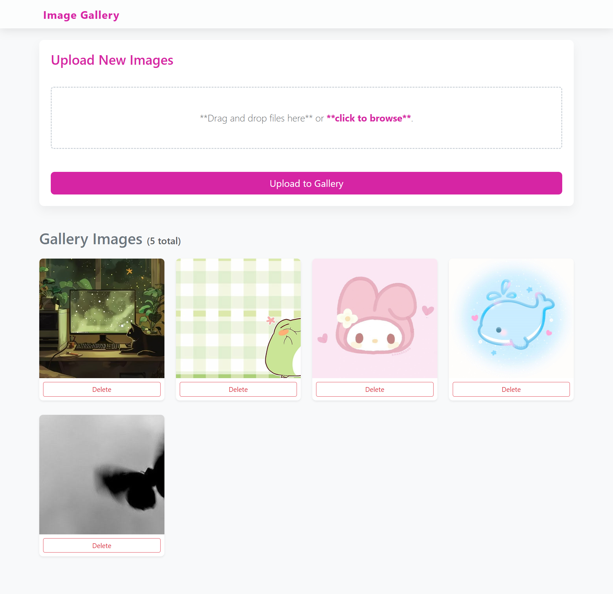

# 🖼️ Laravel Image Gallery App
 
A clean, functional image gallery built with **Laravel**, demonstrating full CRUD media management with secure file handling and efficient database architecture.
 

 

---
 
## 📸 Screenshots
 
> 💡 Add screenshots of the gallery grid, upload form, and edit view here once available.
 
| Gallery View | Upload Form | Edit Image |
| :---: | :---: | :---: |
|  |  |  |
 
---

## 📖 Overview
 
This project demonstrates the implementation of full **CRUD** (Create, Read, Update, Delete) functionality for media management, with an emphasis on secure file handling and clean database design.
 
---

 
## 🧠 Key Learning: File Systems vs. Databases
 
A core architectural decision in this project was moving away from storing raw image data (BLOBs) in the database. Instead, this app implements:
 
- **Path-Based Storage** — Only the file path/string is stored in the MySQL database.
- **Storage Abstraction** — Uses Laravel's `Storage` facade to keep the actual files in the local `storage/app/public` directory.
**Why?** This keeps database performance high, prevents "DB bloat," and makes it straightforward to migrate to cloud storage (e.g. Amazon S3) later.
 
---

## ✨ Features
 
| Feature | Description |
|---------|--------------|
| **Secure Uploads** | Image upload with MIME type validation — only images are accepted |
| **Gallery View** | Responsive grid display of all uploaded images |
| **Edit/Update** | Update image titles or replace existing files |
| **Delete** | Removes both the database record and the physical file from the server |
| **CSRF Protection** | Secure form handling via Laravel's built-in security features |
 
---

 
## 🔒 Security Features
 
- **Validation** — Strict rules for file size and allowed extensions
- **Path Masking** — Files are stored in a way that prevents direct execution of malicious scripts
---
 
## 💻 Tech Stack
 
- **Backend:** PHP 8.x, Laravel 10.x / 11.x
- **Database:** MySQL
- **Frontend:** Blade Templates, Tailwind CSS (or Bootstrap)
- **File Handling:** Laravel Storage Facade
---
